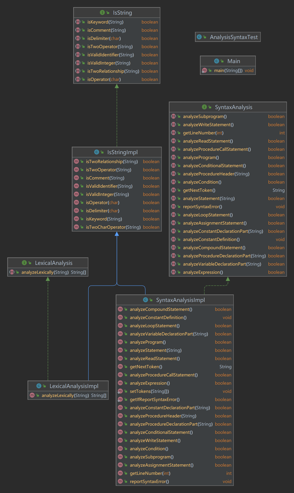

## SyntaxAnalysis 

## 介绍
GUET 编译原理课语法分析部分设代码，主要用于备份代码与纪录，已实现项目要求。
以下是程序类图：

## 运行
使用maven项目管理，用主流开发工具即可编译运行。

## 教程
请参考该网页上的详细教程：[点击到达页面](https://wrm244.gxist.cn/docs/category/编译原理课设)
## LICENSE
MIT © RM 100%
